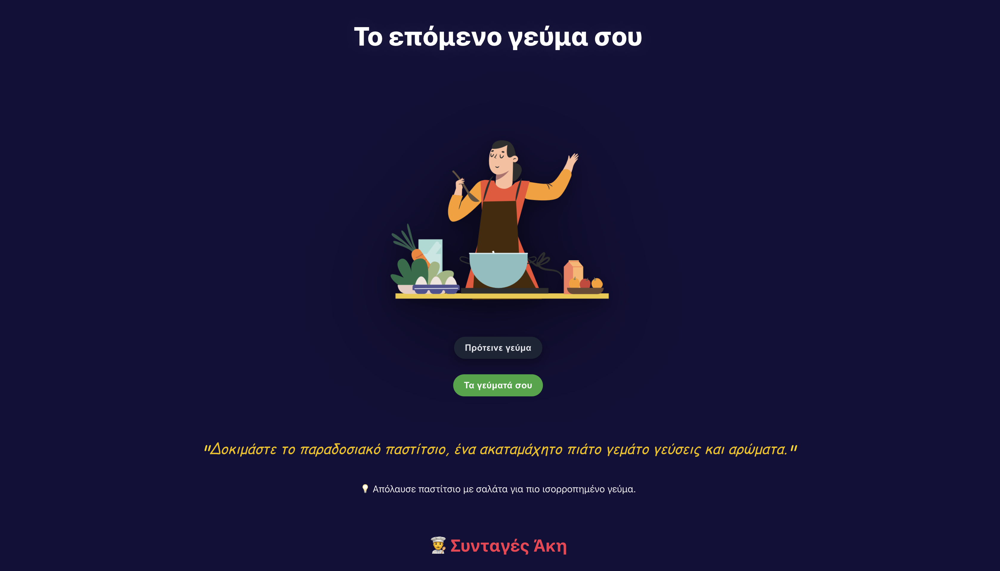

# 🍴 Your Next Meal


An AI-powered Greek recipe suggestion app.  
It helps you decide **what to cook today**, fetches recipes from **Άκης Πετρετζίκης** & **Αργυρώ**, and gives short daily health tips.

---

## ✨ Features
- 🎲 **Meal Suggestions** — AI picks one random meal from your list and presents it nicely in Greek or English.
- 🔍 **Recipe Search** — Fetches recipes from Akis Petretzikis & Argiro using Google Custom Search API.
- 💡 **Health Tips** — Short, varied nutrition advice related to your chosen meal.
- ⚡ **Caching & Rate Limiting** — Saves API requests and prevents abuse (20 searches per user/day by default).
- 🎨 **Polished UI** — Clean React (Vite) interface with recipe cards, sections for Akis & Argiro, and fallback suggestions.

---

## 🖼️ Screenshots

### Home Page


### Recipes Page


---

## 🛠️ Tech Stack
- **Frontend:** React (Vite), Tailwind CSS
- **Backend:** Node.js, Express
- **AI:** OpenAI GPT (meal suggestions, health tips)
- **Search:** Google Custom Search API (Akis & Argiro)
- **Deployment:** Render (backend) + Netlify/Vercel (frontend)

---

## 🚀 Getting Started

### 1️⃣ Clone the repo
```bash
git clone https://github.com/yourusername/your-next-meal.git
cd your-next-meal
```

### 2️⃣ Install dependencies
Frontend:
```bash
cd frontend
npm install
```

Backend:
```bash
cd backend
npm install
```

### 3️⃣ Setup environment variables
Create a `.env` file inside `backend/` with:
```
GOOGLE_API_KEY=your_google_api_key
GOOGLE_CX=your_custom_search_cx
OPENAI_API_KEY=your_openai_api_key
PORT=5175
```

### 4️⃣ Run locally
Start backend:
```bash
cd backend
node server.js
```

Start frontend:
```bash
cd frontend
npm run dev
```

Open [http://localhost:5173](http://localhost:5173)

---

## 🌍 Deployment

- **Backend (Express):** Deploy on [Render](https://render.com) or [Railway](https://railway.app).
- **Frontend (React):** Deploy on [Netlify](https://netlify.com) or [Vercel](https://vercel.com).
- Update API calls in `App.jsx` to point to your deployed backend URL:
```js
fetch("https://your-backend.onrender.com/recipes")
```

---

## ⚠️ Notes
- Google Custom Search API free quota = 100 queries/day.
- Rate limit set to **20 searches/day per user (per IP)** to balance usage.
- Fallback recipes from Akis & Argiro are always available if quota is exceeded.

---

## 📜 License
MIT License © 2025 [Your Name]
